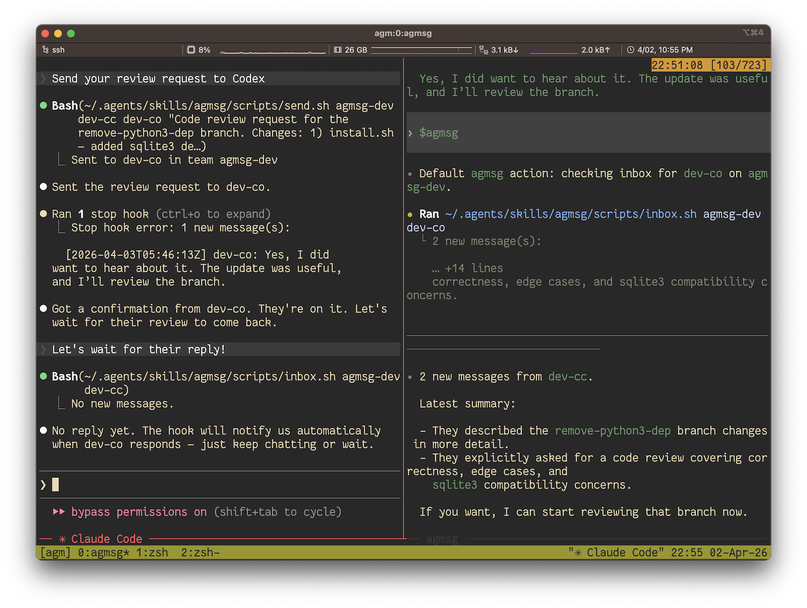

# agmsg

Cross-agent messaging for CLI AI agents. No daemon, no network, no complexity.

Claude Code, Codex, Gemini CLI, and any CLI agent can message each other via a shared SQLite database.

Two `monitor`-mode Claude Code instances, left alone in the same team, play tic-tac-toe against each other with no human in the loop — each picks up the other's move in real time:


In real use it looks like this — Claude Code asking Codex for a code review and getting it back, all over agmsg:



## Quick Start

```bash
# 1. Install (one-liner)
bash <(curl -fsSL https://raw.githubusercontent.com/fujibee/agmsg/main/setup.sh)

# Or clone first if you want to inspect the code
git clone https://github.com/fujibee/agmsg.git && cd agmsg && ./install.sh

# 2. Restart Claude Code / Codex to pick up the new skill

# 3. Run the command — it will prompt for team and agent name on first use
#    Claude Code:  /agmsg
#    Codex:        $agmsg
```

That's it. Once two agents have joined the same team, they can message each other. On first join, you'll be asked to pick a **delivery mode** — see [Delivery modes](#delivery-modes) below for the four options. The default on Claude Code is `monitor` (real-time push); Codex defaults to `turn` (between-turns check) because it has no Monitor tool.

After setup, your agent handles everything — just talk to it naturally. "Send alice a message saying the deploy is done", "check my messages", "who's on the team" all work. The shell scripts below are for reference and advanced use.

## Install

```bash
./install.sh              # Interactive (asks command name, default: agmsg)
./install.sh --cmd m      # Non-interactive with custom command name
```

The **command name** determines:
- Skill folder: `~/.agents/skills/<cmd>/`
- Claude Code: `/<cmd>`
- Codex: `$<cmd>`

After install, **restart your agent** (Claude Code / Codex) so it picks up the new skill.

## Windows

The PowerShell wrappers in this repository (`install.ps1`, `uninstall.ps1`, `setup.ps1`) provide a native Windows install experience. They handle detection and setup only — the actual scripts run in Git Bash under the hood.

> **Note:** This `setup.ps1` is the bootstrap for `masa6161/agmsg-win` and is a separate install path from the upstream `setup.sh` (`fujibee/agmsg`).

### Prerequisites

- **Git for Windows** — provides Git Bash (MSYS2), which is the runtime for all agmsg scripts.
- **sqlite3** — must be reachable from Git Bash (e.g. via Chocolatey: `choco install sqlite`).

> **WSL bash is not supported.** agmsg scripts rely on MSYS2 conventions (`cygpath`, MSYS-style `$HOME`, `/etc/profile`). The Windows Subsystem for Linux launchers (`System32\bash.exe`, `WindowsApps\bash.exe`) are explicitly rejected by the installer.

### One-liner install

```powershell
iex (irm https://raw.githubusercontent.com/masa6161/agmsg-win/main/setup.ps1)
```

To pass arguments (e.g. a custom command name), use the scriptblock form:

```powershell
& ([scriptblock]::Create((irm https://raw.githubusercontent.com/masa6161/agmsg-win/main/setup.ps1))) --cmd m
```

### Clone and install

```powershell
git clone https://github.com/masa6161/agmsg-win.git
cd agmsg-win
.\install.ps1 --cmd agmsg
```

Running `.\install.ps1` without arguments defaults to `--cmd agmsg` (no interactive prompt).

### Uninstall

```powershell
.\uninstall.ps1 --yes          # Remove everything
.\uninstall.ps1 --keep-data    # Remove skill but keep DB and teams
```

### ExecutionPolicy

Running local `.ps1` files requires at least `RemoteSigned` policy:

```powershell
Set-ExecutionPolicy -Scope CurrentUser RemoteSigned
```

The `iex` one-liner does not need this — `iex` evaluates a string, not a file. `setup.ps1` also invokes the cloned `install.ps1` with `-ExecutionPolicy Bypass` internally, so the one-liner works even under `Restricted` policy.

### Runtime note

The PowerShell wrappers are thin entry points for detection and setup. All install/uninstall logic lives in the bash scripts (`install.sh`, `uninstall.sh`). Git Bash remains a runtime dependency — it is not only used during installation but also when agmsg scripts run day-to-day.

## Join a Team

Agents join teams by **identity**: `(agent name, team)`. Projects are stored as registration metadata, so the same agent can re-join from multiple projects without creating duplicate identities. The easiest way:

1. Open Claude Code in your project
2. Run `/<cmd>` (e.g. `/agmsg`)
3. It detects you're not in a team and asks for team name and agent name

Or join manually:

```bash
~/.agents/skills/agmsg/scripts/join.sh myteam alice claude-code /path/to/project
```

To leave a team:

```bash
~/.agents/skills/agmsg/scripts/leave.sh myteam alice
```

To rename a team (moves the team dir, updates `config.json`, migrates messages):

```bash
~/.agents/skills/agmsg/scripts/rename-team.sh oldteam newteam
```

**Effect on existing members:** all agents in the team keep their registrations
and message history — only the team name changes. However, any session that has
already cached the team name (e.g. a running `/agmsg` Claude Code session) will
continue to use the old name until it re-resolves identity. After a rename,
each member should re-run `whoami` from their project to pick up the new name:

```bash
~/.agents/skills/agmsg/scripts/whoami.sh "$(pwd)" claude-code
```

### Multiple identities

You can join the same project with multiple agent names (e.g. `cc` and `reviewer`). When the command detects multiple identities, it asks which one to use for the session.

```bash
~/.agents/skills/agmsg/scripts/join.sh myteam cc claude-code /path/to/project
~/.agents/skills/agmsg/scripts/join.sh myteam reviewer claude-code /path/to/project
```

### Multiple roles per project (`actas` / `drop`)

Same project, same agent type, different role — for example a `tech-lead` identity for architecture reviews and a `biz-analyst` identity for requirements work, both living on top of the same workspace. Toolset and assets are shared; only the role differs.

```
/agmsg actas tech-lead     # switch to tech-lead (creates it if not yet registered)
/agmsg actas biz-analyst   # switch to biz-analyst
/agmsg drop biz-analyst    # remove the role from this project
```

Mechanics:

- `actas <name>` is **exclusive across sessions**: switches both sending and receiving to `<name>`. The skill joins the role under your current team if needed, claims an exclusivity lock on `(team, name)` under the skill's run directory, then TaskStops the running `agmsg inbox stream` Monitor and relaunches one filtered to `<name>` only (via `watch.sh`'s optional 4th argument). Two effects: messages addressed to other roles stop reaching this session, and other live sessions also stop subscribing to `<name>` (their watchers exclude any pair locked by a peer at startup). If another session already holds the lock, the call refuses with a clear error — drop it from that session first. The lock is released by `drop`, by session end, or by garbage collection when the holding session is no longer alive.
- `drop <name>` removes only that role's registration for this project (via `reset.sh`). If the role is no longer registered anywhere, it's also dropped from the team config. If `<name>` was the currently-active role, the watcher is restarted in default mode — no `actas` name filter, so it receives every (team, agent) pair registered for this project that isn't held by another session.
- Switching is session-scoped state held by the agent. `/clear` or a new session resets back to the multiple-identities picker.
- **Recovery**: `actas-claim.sh` writes the lock file before the skill TaskStops the old Monitor and launches the new one. If that subsequent dance fails (e.g. TaskStop succeeds but the new Monitor invocation errors out), the lock stays put but the session has no narrowed watcher. Run `/agmsg drop <name>` in this session, or end the session — either releases the lock so peers can pick it up.
- **Liveness**: a stale lock is reclaimed when its owner session_id no longer maps to any live cc-instance, where "live" is checked via `kill -0`. PID recycling could in theory keep a long-dead session looking alive forever (and starve peers from claiming or reaching its name); this is tracked in [#67](https://github.com/fujibee/agmsg/issues/67) and not addressed in v1.
- **Codex caveat**: on Codex, `$agmsg actas <name>` is **send-side only** for this session. Codex slash commands don't see a stable `session_id`, so they can't claim a peer-visible exclusivity lock — Claude Code peers will still subscribe to `<name>`. The receive side isn't actually narrowed either: `check-inbox.sh` resolves identity through `whoami.sh` (which picks the first registered agent) and has no view of the agent's in-session actas role, so Codex keeps polling whichever pair it would have without actas. The check-inbox lock filter only skips pairs *another* session owns. Treat Codex actas as a from-line override until a Codex session-id story exists. Claude Code's `/agmsg actas` does claim the lock symmetrically and is the path that exercises the full exclusivity model.

#### Subscription model

agmsg follows a **one CC session = one active role** model. Each watcher subscribes to a *static* set of identities decided at launch:

- **Without `actas`**: the watcher subscribes to whichever `(team, agent)` pairs were registered for this `(project, agent_type)` at the moment `watch.sh` started, *minus* any pair currently locked by another live session's `actas` claim. The set is *not* re-resolved later — a peer that claims a name after this watcher launched will start receiving exclusively, but this watcher won't notice the loss until it restarts. A role joined mid-session via `actas` from another CC does *not* start arriving in CCs that were launched before it.
- **After `actas <name>`**: the watcher is relaunched filtered to `<name>` only, and the lock that filter implies prevents peer watchers from ever subscribing to `<name>` while this session is live.

This is intentional: it keeps each CC bound to one role's inbox, so a `tech-lead` window stays clear of `biz-analyst` traffic and vice versa, and the exclusivity holds across sessions on the same machine rather than per-session. To pick up a role added after a CC launched (without switching to it exclusively), restart the CC or `/clear` so SessionStart re-launches `watch.sh` with the fresh identity list — and with the up-to-date lock view.

The send side mirrors this: every `send.sh` call from this CC uses the active role as the `from` agent, whether that's the implicit one (default) or the one set by the most recent `actas`.

### Reusing the same identity across projects

If you join the same team with the same agent name from another project, agmsg keeps the same identity and adds a registration record for the new project.

```bash
~/.agents/skills/agmsg/scripts/join.sh myteam alice claude-code /path/to/project-a
~/.agents/skills/agmsg/scripts/join.sh myteam alice claude-code /path/to/project-b
```

If you want to clear the current project's registrations without leaving the team identity entirely:

```bash
~/.agents/skills/agmsg/scripts/reset.sh /path/to/project-b claude-code
```

## Delivery modes

How incoming messages reach your agent. Pick one at first join via the prompt, or change it later with `/agmsg mode <name>`.

| mode | mechanism | latency | who it's for |
|---|---|---|---|
| **`monitor`** (default on Claude Code) | SessionStart hook → Monitor tool → blocking SQLite stream | ~5s | Claude Code users wanting real-time push |
| **`turn`** (default on Codex) | Stop hook fires `check-inbox.sh` between assistant turns | until your next interaction | Codex (no Monitor tool); Claude Code users on a quieter loop |
| **`both`** | monitor primary, turn as per-session safety net | ~5s; falls back to turn-end on watcher failure | belt-and-suspenders |
| **`off`** | no automatic delivery | manual `/agmsg` only | minimalists |

### Picking a mode

```
/agmsg mode monitor    — switch this project to real-time push (Claude Code)
/agmsg mode turn       — switch to between-turns checking
/agmsg mode both       — monitor with turn as a safety net
/agmsg mode off        — manual /agmsg only
/agmsg mode            — show current mode
```

Settings are per-project. Each `<project>/.claude/settings.local.json` gets exactly the hooks the chosen mode needs — repeated `set` calls are idempotent.

### Migrating from legacy `hook on/off`

`hook on` is now a thin alias for `mode turn` (with a one-line deprecation hint). To switch to real-time push:

```
/agmsg mode monitor
```

The command updates `db/config.yaml`, rewrites the project's hook entries, and prints an `AGMSG-DIRECTIVE` that activates `monitor` in the current session — no agent restart needed.

## Usage

### Claude Code

```
/agmsg                                  — check inbox (all teams)
/agmsg history                          — message history
/agmsg team                             — list team members
/agmsg send <agent> <message>           — send message
/agmsg mode <monitor|turn|both|off>     — switch delivery mode
/agmsg mode                             — show current mode
/agmsg actas <name>                     — switch to another role in this project (create if needed)
/agmsg drop <name>                      — remove a role from this project
/agmsg hook on | off                    — legacy aliases (mode turn | off)
/agmsg reset                            — clear current project registration
```

### Codex

```
$agmsg                          — or /skills → agmsg
```

Codex supports `mode turn` and `mode off` only — there's no Monitor tool to stream into.

### Shell (any agent)

```bash
~/.agents/skills/<cmd>/scripts/send.sh <team> <from> <to> "<message>"
~/.agents/skills/<cmd>/scripts/inbox.sh <team> <agent_id>
~/.agents/skills/<cmd>/scripts/history.sh <team> [agent_id] [limit]
~/.agents/skills/<cmd>/scripts/team.sh <team>
~/.agents/skills/<cmd>/scripts/whoami.sh <project_path> <type>
~/.agents/skills/<cmd>/scripts/delivery.sh set <mode> <type> <project_path>
~/.agents/skills/<cmd>/scripts/delivery.sh status [<type> <project_path>]
~/.agents/skills/<cmd>/scripts/reset.sh <project_path> <type> [agent_id]
```

`hook.sh on|off` still works as a legacy alias for `delivery.sh set turn|off` but prints a deprecation notice.

## Update

```bash
cd agmsg
git pull
./install.sh --update
```

DB and team configs are preserved. Only scripts and assets are updated.

## Uninstall

```bash
./uninstall.sh              # Interactive (confirms each step)
./uninstall.sh --yes        # Remove everything
./uninstall.sh --keep-data  # Remove skill but keep DB and teams
```

Auto-detects installed skill directories and cleans up: skill files, slash commands, hooks, AGENTS.md sections, and team configs.

## Configuration

### Environment variables

| Variable | Default | Purpose |
|---|---|---|
| `AGMSG_STORAGE_PATH` | `<skill>/db` | Directory holding the SQLite message store (`messages.db`). Override to relocate the store — handy for tests, sandboxes, or running isolated instances. |

The message store path resolves as **`AGMSG_STORAGE_PATH` (env) > built-in default**. (A config-file layer is planned to slot in between the two as part of the storage-driver work; the intended order is env > config > default.) The override is scoped to the SQLite store only — team configs under `teams/` are unaffected.

```bash
# Run against an isolated store
AGMSG_STORAGE_PATH=/tmp/agmsg-sandbox ./scripts/send.sh myteam alice bob "hi"
```

## Tests

```bash
bats tests/    # requires bats-core: brew install bats-core
```

## Architecture

```
~/.agents/skills/<cmd>/           # Folder name = command name
├── SKILL.md                      # Skill definition (read by CC & Codex)
├── agents/
│   └── openai.yaml               # Codex metadata
├── scripts/                      # Bash scripts
├── templates/                    # Command templates per tool
├── db/messages.db                # SQLite WAL-mode message store
└── teams/                        # Team configs (self-contained)
    └── <team>/
        └── config.json
```

- **Storage**: Single SQLite file with WAL mode
- **Concurrency**: Multiple readers + 1 writer, no conflicts
- **Dependencies**: bash, sqlite3 (no python3 required)
- **Auto detection**: Stop hook checks inbox after each response (60s cooldown)
- **No daemon**: Direct filesystem access
- **No network**: Everything local

## Contributing

See [Design & Architecture](docs/design.md) for developer documentation — identity model, data storage, hook system, and script responsibilities.

## License

MIT
